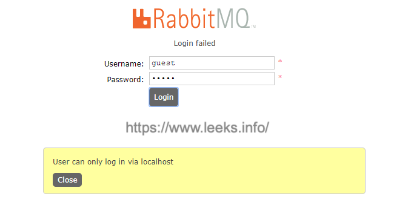

# 安装RabbitMQ服务

RabbitMQ 是由 LShift 提供的一个 Advanced Message Queuing Protocol (AMQP) 的开源实现，由以高性能、健壮以及可伸缩性出名的 Erlang 开发设计，因此也是继承了这些优点。

本文档旨在基于 Erlang 环境在 CentOS 7 系统上安装配置 RabbitMQ

因为 RabbitMQ 是用 Erlang 开发实现的，所以在安装 RabbitMQ 之前需要先配置完成 Erlang 的开发环境，Erlang 的具体安装配置可以参考：[安装Erlang环境](wiz://open_document?guid=3e0cb48f-1f0f-4592-b42e-0ed0c8ee72e3&kbguid=&private_kbguid=fe89a0f7-56e7-4d32-b1af-de509c704437)

## 安装系统环境及版本如下

```shell
$ cat /etc/redhat-release
Red Hat Enterprise Linux Server release 7.3 (Maipo)
$ uname -r
3.10.0-514.el7.x86_64
Erlang : 22.1
RabbitMQ: v3.7.9
```

为了安装方便，本次安装方式选用 yum 的方式安装。

**注：**erlang 与 centos，rabbitmq 与 erlang，这些都是有依赖关系的，不同版本会存在不兼容性，可能导致安装完成后无法启动的情况，如果遇到此情况，可以查看官方版本兼容性文档，rabbitmq 官方给出的与 erlang/OTP 的版本兼容要求可以参考[文档](http://www.rabbitmq.com/which-erlang.htm)


[RabbitMQ 的官方站点](https://www.rabbitmq.com)

[RabbitMQ 的官方下载地址](https://www.rabbitmq.com/download.html)

本次我们在 CentOS 7 上安装 RabbitMQ 服务，更为详细的或者其他系统的安装过程可以参考官方[文档](https://www.rabbitmq.com/download.html)

## 下载 RabbitMQ 软件包

```shell
$ mkdir /opt/soft; cd /opt/soft
$ wget https://github.com/rabbitmq/rabbitmq-server/releases/download/v3.7.9/rabbitmq-server-3.7.9-1.el7.noarch.rpm
```

## 安装 RabbitMQ

```shell
$ rpm --import https://github.com/rabbitmq/signing-keys/releases/download/2.0/rabbitmq-release-signing-key.asc
$ yum install rabbitmq-server-3.7.9-1.el7.noarch.rpm -y
```

**注：**有时侯在安装的过程中会报错，这个可能是由于 RabbitMQ 和 Erlang 的版本问题，当我们遇到相关错误的时候，可以尝试更换版本。

## 启动相关服务

```shell
$ systemctl start rabbitmq-server
$ systemctl enable rabbitmq-server
Created symlink from /etc/systemd/system/multi-user.target.wants/rabbitmq-server.service to /usr/lib/systemd/system/rabbitmq-server.service.
```

## 检查 RabbitMQ 服务的状态

```shell
$ rabbitmqctl status
Status of node rabbit@test1 ...
[{pid,1686},
 {running_applications,
     [{rabbit,"RabbitMQ","3.7.9"},
      {mnesia,"MNESIA CXC 138 12","4.16.1"},
      {os_mon,"CPO CXC 138 46","2.5.1"},
      {rabbit_common,
          "Modules shared by rabbitmq-server and rabbitmq-erlang-client",
          "3.7.9"},
      {ranch_proxy_protocol,"Ranch Proxy Protocol Transport","2.1.1"},
      {ranch,"Socket acceptor pool for TCP protocols.","1.6.2"},
      {ssl,"Erlang/OTP SSL application","9.4"},
      {public_key,"Public key infrastructure","1.7"},
      {asn1,"The Erlang ASN1 compiler version 5.0.9","5.0.9"},
      {recon,"Diagnostic tools for production use","2.3.6"},
      {jsx,"a streaming, evented json parsing toolkit","2.9.0"},
      {inets,"INETS CXC 138 49","7.1.1"},
      {xmerl,"XML parser","1.3.22"},
      {crypto,"CRYPTO","4.6"},
      {lager,"Erlang logging framework","3.6.5"},
      {goldrush,"Erlang event stream processor","0.1.9"},
      {compiler,"ERTS CXC 138 10","7.4.6"},
      {syntax_tools,"Syntax tools","2.2.1"},
      {sasl,"SASL CXC 138 11","3.4.1"},
      {stdlib,"ERTS CXC 138 10","3.10"},
      {kernel,"ERTS CXC 138 10","6.5"}]},
 {os,{unix,linux}},
 {erlang_version,
     "Erlang/OTP 22 [erts-10.5.2] [source] [64-bit] [smp:1:1] [ds:1:1:10] [async-threads:64] [hipe]\n"},
 {memory,
     [{connection_readers,0},
      {connection_writers,0},
      {connection_channels,0},
      {connection_other,0},
      {queue_procs,0},
      {queue_slave_procs,0},
      {plugins,16804},
      {other_proc,30593488},
      {metrics,195268},
      {mgmt_db,0},
      {mnesia,75304},
      {other_ets,2439096},
      {binary,77208},
      {msg_index,29440},
      {code,20565356},
      {atom,1131721},
      {other_system,9810843},
      {allocated_unused,11582848},
      {reserved_unallocated,0},
      {strategy,rss},
      {total,[{erlang,64934528},{rss,70696960},{allocated,76517376}]}]},
 {alarms,[]},
 {listeners,[{clustering,25672,"::"},{amqp,5672,"::"}]},
 {vm_memory_calculation_strategy,rss},
 {vm_memory_high_watermark,0.4},
 {vm_memory_limit,416360038},
 {disk_free_limit,50000000},
 {disk_free,11584901120},
 {file_descriptors,
     [{total_limit,32668},
      {total_used,2},
      {sockets_limit,29399},
      {sockets_used,0}]},
 {processes,[{limit,1048576},{used,210}]},
 {run_queue,1},
 {uptime,32},
 {kernel,{net_ticktime,60}}]
```

 当 RabbitMQ 服务正常启动后，我们可以查看对应的日志，日志默认在 /var/log/rabbitmq/目录下。日志中给出了rabbitmq 启动的重要信息，如 node 名，$home 目录，cookie hash 值，日志文件，数据存储目录等，但是默认情况下没有配置文件的相关信息，我们需要手动创建配置文件

## 准备 RabbitMQ 配置文件

首先需要手动创建 /etc/rabbitmq 目录，然后把配置文件模板复制到此目录下：

```shell
$ cd /etc/rabbitmq/
$ cp /usr/share/doc/rabbitmq-server-3.7.9/rabbitmq.config.example /etc/rabbitmq/rabbitmq.config
```

配置文件准备好后，就可以重启服务了：

```shell
$ systemctl restart rabbitmq-server.service
```

另外还可以建环境配置文件：/etc/rabbitmq/rabbitmq-env.conf

## 安装 web 插件

management plugin 默认就在 RabbitMQ 的发布版本中，enable即可：

```shell
$ rabbitmq-plugins enable rabbitmq_management
The following plugins have been configured:
  rabbitmq_management
  rabbitmq_management_agent
  rabbitmq_web_dispatch
Applying plugin configuration to rabbit@test1...
The following plugins have been enabled:
  rabbitmq_management
  rabbitmq_management_agent
  rabbitmq_web_dispatch
started 3 plugins.
$ chown -R rabbitmq:rabbitmq /var/lib/rabbitmq/
```

安装完成后在浏览器访问 web ui：http://10.0.7.161:15672/


默认登陆账号密码均为 guest ,当我们首次登陆的时候会报错，报错信息类似：`User can only log in via localhost`



在这里 我们需要创建一个新的管理员账号：

```shell
$ rabbitmqctl add_user admin admin
Adding user "admin" ...
$ rabbitmqctl set_user_tags admin administrator
Setting tags for user "admin" to [administrator] ...
$ rabbitmqctl set_permissions -p / admin ".*" ".*" ".*"
Setting permissions for user "admin" in vhost "/" ...
$ rabbitmqctl list_users
Listing users ...
user tags
admin [administrator]
guest [administrator]
```

- `rabbitmqctl add_user`  添加账号，并设置密码

- `rabbitmqctl set_user_tags` 设置账号的状态

- `rabbitmqctl set_permissions`  设置账号的权限

- `rabbitmqctl list_users`  列出账号

至此，就可以用新建的管理员账号登陆 WEB 页面了。