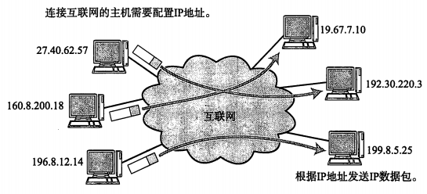
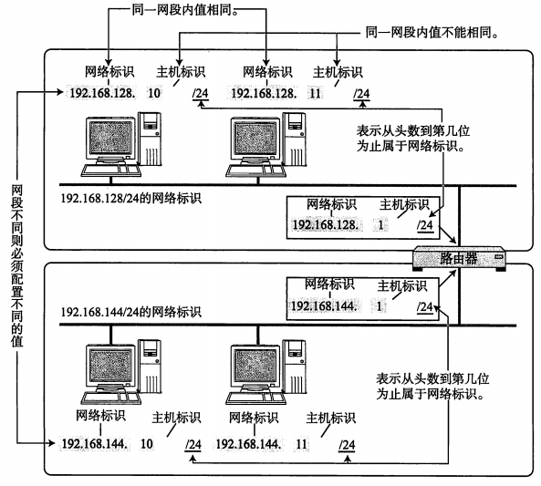
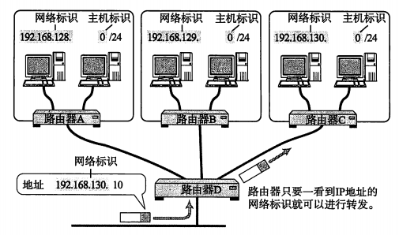
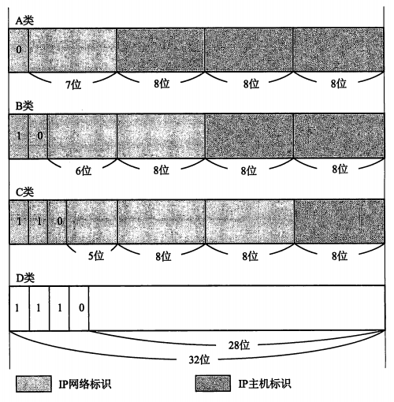
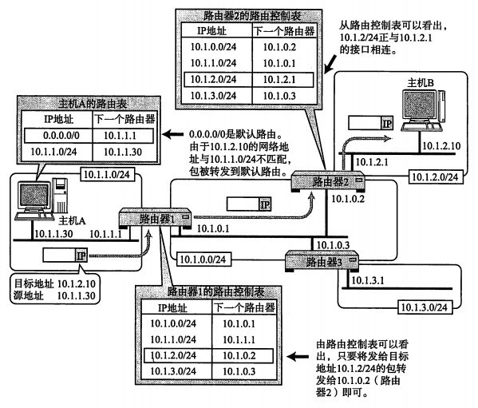
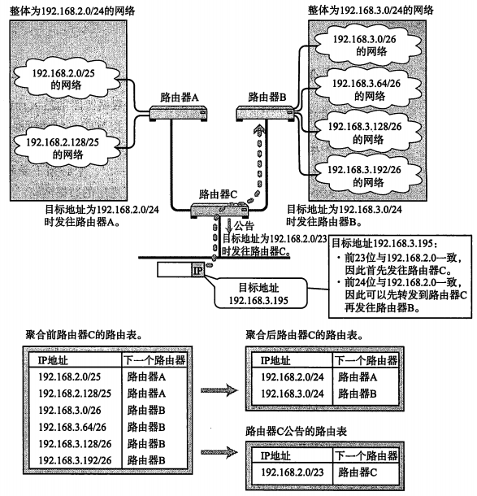
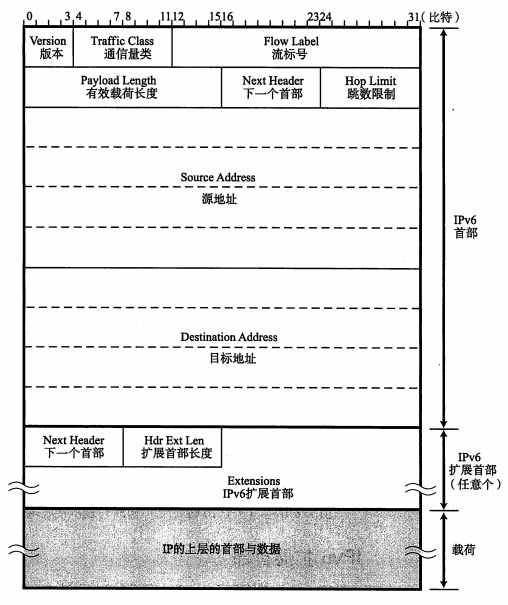

# IP 协议

## IP基础

TCP/IP的心脏是互联网层，这一层主要有IP和ICMP两个协议组成，在OSI参考模型中为第三层（网络层）。网络层的主要作用是实现终端节点之间的通信（点对点通信）。

### 网络层与数据链路层的关系

### IP寻址

IP地址用于在“连接到网络中的所有主机中识别出进行通信的目标地址”。因此TCP/IP通信中所有主机或路由器必须设定自己的IP地址（每块网卡至少配置一个或以上的IP地址）。

### 路由控制

路由控制是指将分组数据发送到最终目标地址的功能。

IP数据包类似快递中的包裹，送货车类似数据链路，包裹依赖送货车承载转运，而一辆送货车只能将包裹送到某个区间内，由新的快递点安排新的送货车来进行下一区间的运输。

### 路由控制表

为了将数据包发给目标主机，所有主机都维护一张路由控制表（Routing Table）,该表记录IP数据在下一步应该发给哪个路由器。IP包根据这个路由表在各个数据链路上传输。

### 数据链路的抽象化

IP是实现多个数据链路之间通信的协议。对不同数据链路的相异特性进行抽象化也是IP的重要作用之一。不同数据链路最大的区别在于它们各自的最大传输单位（MTU）不同，类似快递包裹有各自的大小限制。当数据包过大时，IP进行分片处理，即将大的IP包分成多个较小的IP包，当到目标地址后再被组合起来传给上一层。

### IP是面向无连接型

IP发包之前不需要提前与目标建立连接。采用面向无连接的原因：为了简化和提速。面向连接型需要提前建立连接会降低处理速度。IP只负责将数据发给目标主机，但途中可能会发生丢包、错位、数据量翻倍等问题。TCP则是面向连接的协议，负责保证对端主机确实收到数据。

## IP地址

在TCP/IP通信中，用IP地址识别主机和路由器。

### IP地址的定义

IP地址（IPv4地址）由32位正整数来表示。IP地址在计算机内部以二进制方式被处理，但习惯将32位的IP地址以8位为一组，分成4组，每组以“.”隔开，转换成10进制来表示。IPv4地址为32位，最多允许43亿台计算机连接网络。

实际上，IP地址并非根据主机台数来分配而是每一台主机上的每一块网卡都得设置IP地址，一块网卡可以设置一个或以上个IP,路由器通常会配置两个以上的网卡。

### IP地址由网络和主机两部分标识组成

IP地址由“网络地址”和“主机地址”两部分组成。

网络标识在数据链路的每个段配置不同的值，必须保证相互连接的每个段的地址不重复，相同段内连接的主机必须有相同的网络地址。主机标识则不允许同一个网段内重复出现。在某一范围内，IP地址需具有唯一性。

IP包被转发到某个路由器时，是利用目标IP地址的网络标识进行路由，即使不看主机地址，由网络地址则可判断是否是该网段内的主机。

### IP地址的分类

IP地址分为A、B、C、D四类。

<table border="1" cellpadding="10" cellspacing="10">
  <thead>
    <tr><th>IP地址类别</th><th>地址开头</th><th>网络地址</th><th>主机地址</th><th>范围</th><th>一个网段内主机地址个数</th><th>备注</th></tr>
  </thead>
    <tbody>
      <tr><td>A类地址</td><td>0</td><td>第1-8位</td><td>后24位</td><td>0.0.0.0~127.0.0.0</td><td>2^24-2=16777214</td><td></td></tr>
      <tr><td>B类地址</td><td>10</td><td>第1-16位</td><td>后16位</td><td>128.0.0.0~191.255.0.0</td><td>2^16-2=65534</td><td></td></tr>
      <tr><td>C类地址</td><td>110</td><td>第1-24位</td><td>后8位</td><td>192.0.0.0~239.255.255.0</td><td>2^8-2=254</td><td></td></tr>
      <tr><td>D类地址</td><td>1110</td><td>第1-32位</td><td>没有主机地址</td><td>224.0.0.0~239.255.255.255</td><td></td><td>常用于多播</td></tr>
  </tbody>
</table>

注意：同一个网段中的主机地址分配，主机地址全为0表示对应的网络地址，主机地址全为1通常用于广播地址。因此一个网段内主机的个数去掉2个（例如2^8-2=254）。

### 子网隐码

用1表示网络地址的范围，用0表示主机地址的访问。因此A、B、C类可表示为

<table border="1" cellpadding="10" cellspacing="10">
  <thead>
    <tr><th>IP类别</th><th>表示</th></tr>
  </thead>
    <tbody>
      <tr><td>A类</td><td>255.0.0.0</td></tr>
      <tr><td>B类</td><td>255.255.0.0</td></tr>
      <tr><td>C类</td><td>255.255.255.0</td></tr>
  </tbody>
</table>

按照以上的组合方式IP有点浪费，因此产生子网隐码的分类方法减少这种浪费。

引入子网后，IP地址由两种识别码组成：IP地址本身+表示网络地址的子网隐码。即将A,B,C类中的主机地址拆成网络部分和主机部分，重新分配网络地址和主机地址。子网隐码同样是用1表示网络地址的范围，用0表示主机地址的访问。

### 子网隐码的表示方法

<table border="1" cellpadding="10" cellspacing="10">
  <thead>
    <tr><th>表示方法</th><th>地址</th><th></th><th>子网隐码</th><th>备注</th></tr>
  </thead>
    <tbody>
      <tr><td>数字</td><td>IP地址</td><td>172.20.100.52</td><td>255.255.255.192</td><td></td></tr>
      <tr><td>网络地址</td><td>172.20.100.0</td><td>255.255.255.192</td><td></td><td></td></tr>
      <tr><td>广播地址</td><td>172.20.100.63</td><td>255.255.255.192</td><td></td><td></td></tr>
      <tr><td>“/26”，表示前26位为网络地址</td><td>IP地址</td><td>172.20.100.52/26</td><td></td><td></td></tr>
      <tr><td>网络地址</td><td>172.20.100.0/26</td><td></td><td></td><td></td></tr>
      <tr><td>广播地址</td><td>172.20.100.63/26</td><td></td><td></td><td></td></tr>
  </tbody>
</table>

## 路由控制

发送数据包除了有目标IP地址外，还需要指明路由器和主机的信息，即路由控制表。

路由控制表的形成方式有两种：

1、静态路由

由管理员手动设置

2、动态路由

路由器与其他路由器相互交互信息时自动刷新。为了让动态路由及时刷新路由表，在网络上互联的路由器之间需设置路由协议，保证正常读取路由控制信息。

### IP地址和路由控制

IP地址的网络地址部分用于进行路由控制。路由控制表中记录着网络地址与下一步应该发送至路由器的地址。在发送IP包时，首先确认IP包首部中的目标地址，再从路由控制表中找到与该地址具有相同网络地址的记录，根据该记录将IP包转发给相应的下一个路由器。如果存在多条相同网络地址的记录，则选择最为吻合的网络地址（相同位数最多）。例如：172.20.100.52的网络地址与172.20.0/16和172.20.100.0/24都匹配，则选择匹配最长的172.20.100.0/24。

### 默认路由

默认路由一般标记为0.0.0.0/0或default。当路由表中没有任何一个地址与之匹配的记录，则使用默认路由。

#### 主机路由

“IP地址/32”也被称为主机路由，即整个IP地址的所有位都参与路由。进行主机路由意味着基于主机上网卡配置的IP地址本身而不是基于该地址的网络地址进行路由。一般用于不希望通过网络地址路由的情况。使用主机路由会导致路由表膨大，路由负荷增加，网络性能下降。

#### 环回地址

环回地址是在同一台计算机上程序之间进行网络通信时所使用的一个默认地址。即IP地址为127.0.0.1，主机名为localhost。

### 路由控制表的聚合

路由信息的聚合可以有效的减少路由表的条目。路由表越大，管理它所需要的内存和CPU就越多，查找路由表的时间越长，导致转发IP包性能下降。要构建高性能网络就需要尽可能减少路由表的大小。

## IP首部信息

IP进行通信时，需要在数据前面加入IP首部信息，IP首部包含着用于IP协议进行发包控制时所有的必要信息。

### IPv4首部

<table border="1" cellpadding="10" cellspacing="10">
  <thead>
    <tr><th>字段</th><th>说明</th><th>大小</th></tr>
  </thead>
    <tbody>
      <tr><td>版本</td><td>标识IP首部的版本号，IPv4，即版本号为4</td><td>4比特</td></tr>
      <tr><td>首部长度</td><td>表示IP首部的大小，单位为4字节</td><td>4比特</td></tr>
      <tr><td>区分服务</td><td>表示服务质量</td><td>8比特</td></tr>
      <tr><td>DSCP段与ECN段</td><td>DSCP用来进行质量控制，值越大优先度越高；ECN用来报告网络拥堵情况</td><td>2比特</td></tr>
      <tr><td>总长度</td><td>表示IP首部与数据部分合起来的总字节数</td><td>16比特</td></tr>
      <tr><td>标识</td><td>用于分片重组，同一个分片标识值相同，不同分片的标识值不同</td><td>16比特</td></tr>
      <tr><td>标志</td><td>表示包被分片的相关信息</td><td>3比特</td></tr>
      <tr><td>片偏移</td><td>用来标识被分片的每一个分段相对于原始数据的位置。</td><td>13比特</td></tr>
      <tr><td>生存时间（TTL）</td><td>本意为包的生存期限，一般表示可以中转多少个路由器，每经过一个路由器TTL减1，直到变为0则丢弃该包</td><td>8比特</td></tr>
      <tr><td>协议</td><td>表示IP首部的下一个首部隶属于哪个协议。</td><td>8比特</td></tr>
      <tr><td>首部校验和</td><td>IP首部校验和，用来确保IP数据报不被破坏。</td><td>16比特</td></tr>
      <tr><td>源地址</td><td>发送端IP地址</td><td>32比特</td></tr>
      <tr><td>目标地址</td><td>接收端IP地址</td><td>32比特</td></tr>
      <tr><td>可选项</td><td>安全级别、源路径、路径记录、时间戳</td><td></td></tr>
      <tr><td>填充</td><td>填补物，调整大小使用</td><td></td></tr>
      <tr><td>数据</td><td>存入数据</td><td></td></tr>
  </tbody>
</table>

### IPv6首部

<table border="1" cellpadding="10" cellspacing="10">
  <thead>
    <tr><th>字段</th><th>说明</th></tr>
  </thead>
    <tbody>
      <tr><td>版本</td><td>IPv6,版本为6</td></tr>
      <tr><td>通信量类</td><td>相当于IPv4的TOS（Type Of Service）字段</td></tr>
      <tr><td>流标号</td><td>用于服务质量控制</td></tr>
      <tr><td>有效载荷长度</td><td>包的数据部分</td></tr>
      <tr><td>下一个首部</td><td>相当于IPv4的协议字段</td></tr>
      <tr><td>跳数限制</td><td>Hop Limit，同IPv4的TTL,表示可通过的路由器个数</td></tr>
      <tr><td>源地址</td><td>发送端的IP地址</td></tr>
      <tr><td>目标地址</td><td>接收端的IP地址</td></tr>
  </tbody>
</table>

