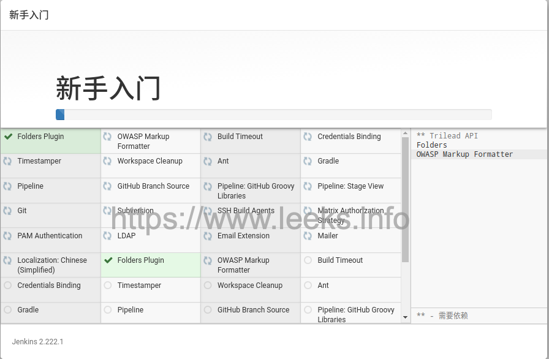
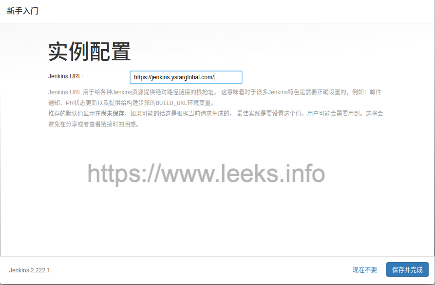
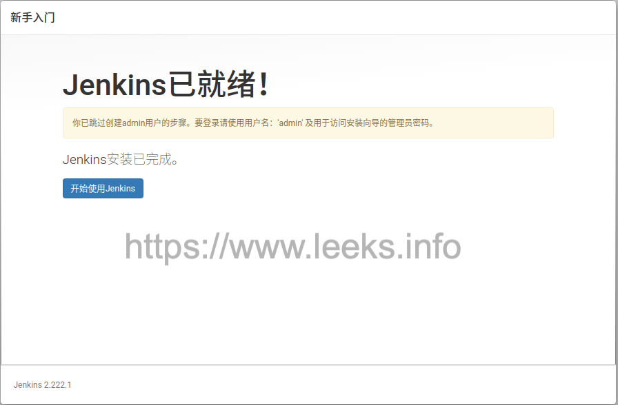
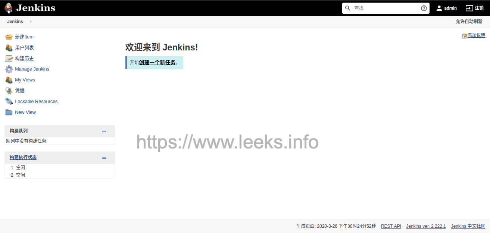
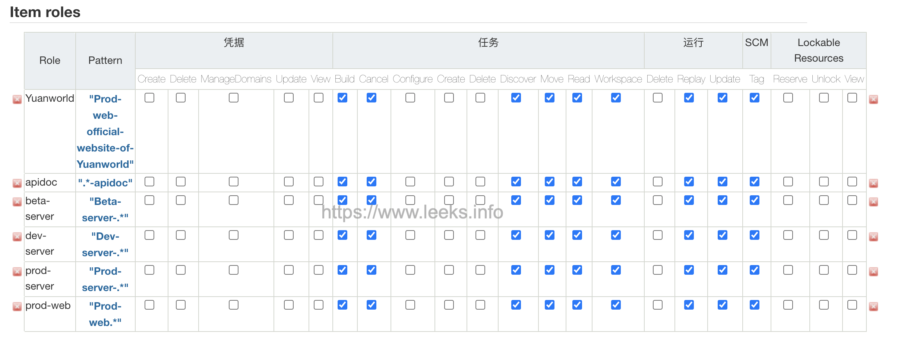
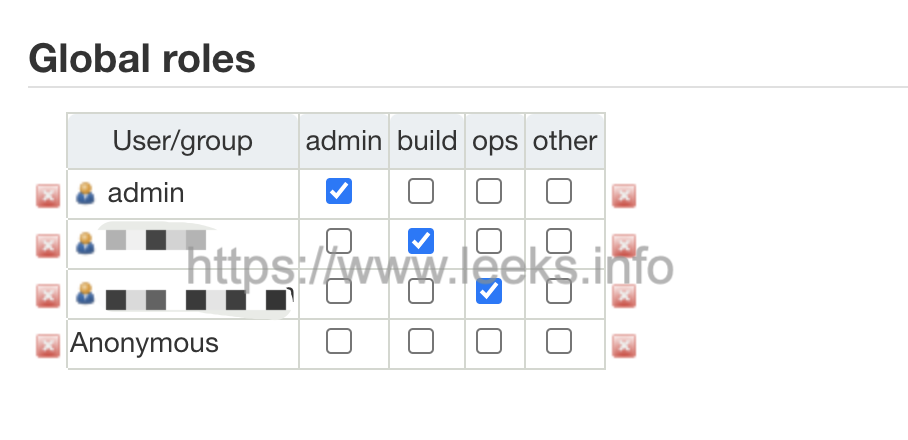

# Jenkins

## 部署及配置 Jenkins

1. 修改环境变量

   ```shell
   $ vim /etc/profile
   ########################增加##############################
   # Java环境变量
   export JAVA_HOME=/opt/jdk1.8.0_131
   export PATH=$JAVA_HOME/bin:$PATH
   export CLASSPATH=.:$JAVA_HOME/lib/dt.jar:$JAVA_HOME/lib/tools.jar
   ##########################################################
   
   $ source /etc/profile
   ```

2. 创建运行用户及下载软件

   ```shell
   # 创建Jenkins用户
   $ useradd -s /usr/sbin/nologin -d /opt/jenkins -M jenkins
   # 下载Jenkins最新版本包
   $ mkdir /opt/jenkins
   $ cd /opt/jenkins && wget http://mirrors.jenkins.io/war-stable/latest/jenkins.war
   ```

3. 创建启动脚本

   ```shell
   $ vim /opt/jenkins/jenkins.sh
   #################################脚本内容##################################
   #!/bin/bash
   # 导入环境变量
   export JENKINS_HOME=/opt/jenkins
   export JAVA_HOME=/opt/jdk1.8.0_131
   cd $JENKINS_HOME
   pid=`ps -ef | grep jenkins.war | grep -v 'grep'| awk '{print $2}'`
   if [ "$1" = "start" ];then
       if [ -n "$pid" ];then
           echo 'jenkins is running...'
       else
           ### java启动服务 配置java安装根路径,和启动war包存的根路径
           sudo -E -u jenkins nohup $JAVA_HOME/bin/java -Xms1024m -Xmx1024m -jar $JENKINS_HOME/jenkins.war --ajp13Port=-1 --httpPort=18080 >/dev/null 2>&1 &
       fi
   elif [ "$1" = "stop" ];then
       exec ps -ef | grep jenkins | grep -v grep | awk '{print $2}'| xargs kill -9
       echo 'jenkins is stop...'
   else
       echo "Please input like this:"./jenkins.sh start" or "./jenkins stop""
   fi
   ```

4. 启动服务

   ```shell
   $ /opt/jenkins/jenkins.sh start
   ```

5. 修改配置

   ```shell
   # 备份default.json
   $ cp /opt/jenkins/updates/default.json /opt/jenkins/updates/default.json.bak
   # 替换插件下载地址
   $ sed -i 's/https:\/\/updates.jenkins.io\/download/https:\/\/mirrors.tuna.tsinghua.edu.cn\/jenkins/g' /opt/jenkins/updates/default.json
   $ sed -i 's/http:\/\/www.google.com/https:\/\/www.baidu.com/g' /opt/jenkins/updates/default.json
   ```

6. 访问Jenkins

   ```shell
   # https://jenkins.域名.com/
   # 复制密钥
   $ cat /opt/jenkins/secrets/initialAdminPassword
   ```

   

   

7. 安装推荐的插件

   

   安装推荐插件需要一点点时间等待，请耐心！！！

   

8. 登录admin

   安装完成后，会进入到创建第一个管理员用户页面，我选择的是继续使用admin账户，如下图所示。

   

9. 配置 URL

   

   这一步配置完成后，选择开始使用Jenkins。

   

   登录后的页面如下图所示，到这里Jenkins就安装部署完成。

   

## Jenkins反向代理配置有误问题修复

Jenkins URL使用 nginx 代理 HTTPS 网络协议时，Jenkins内部会出现反向代理配置有误的问题，

需要在nginx配置中设置 X-Forwarded-Proto 参数

```nginx
server {
    listen 443 ssl;
    server_name jenkins.xxxx.com;

    ssl_certificate   /opt/cert/Nginx/1_jenkins.xxxx.com_bundle.crt;
    ssl_certificate_key  /opt/cert/Nginx/2_jenkins.xxxx.com.key;
    ssl_session_timeout 5m;
    ssl_ciphers ECDHE-RSA-AES128-GCM-SHA256:ECDHE:ECDH:AES:HIGH:!NULL:!aNULL:!MD5:!ADH:!RC4;
    ssl_protocols TLSv1 TLSv1.1 TLSv1.2;
    ssl_prefer_server_ciphers on;

    location / {
        proxy_pass http://jenkins;
        client_max_body_size 1024M;
        proxy_next_upstream error timeout http_500 http_502 http_503 http_504;
        proxy_set_header Host $host;
        proxy_set_header X-Real-IP $remote_addr;
        proxy_set_header X-Forwarded-For $proxy_add_x_forwarded_for;
        proxy_set_header X-Forwarded-Proto $scheme;
        proxy_set_header Connection "";
        proxy_http_version 1.1;

    }
}
```

参考链接：https://cloud.tencent.com/developer/article/1476876

## 用户权限配置

1. 安装插件

   插件：Role-based Authorization Strategy

   

2. 全局安全配置-授权策略

   当插件安装好的时候，授权策略会多出一个Role-Based Strategy选项，选择该项并保存

   

3. 管理和分配角色

   在系统管理页面进入 Manage and Assign Roles

   

4. 管理角色

   

5. 全局角色

   **设置全局角色（全局角色可以对jenkins系统进行设置与项目的操作）**

   > admin：对整个jenkins都可以进行操作 
   >
   > ops：可以对所有的job进行管理
   >
   > other：只有读的权限
   >
   > build：操作构建权限

   

6. 项目角色

   **注意：Pattern是设置正则表达式，其中test.\*表示匹配以test开头的job name**

   

7. 分配角色

   

   

   

