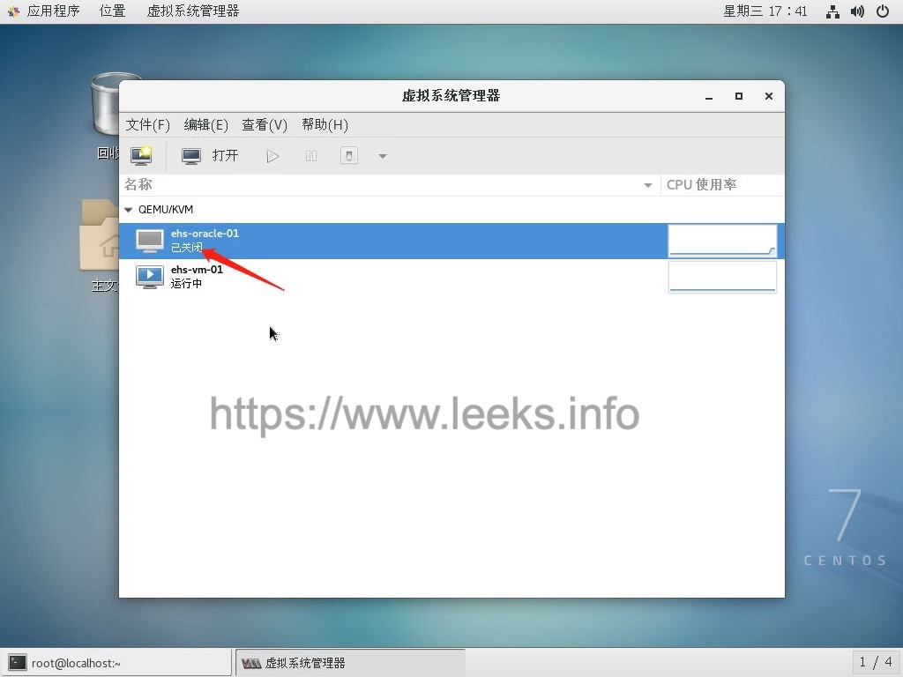
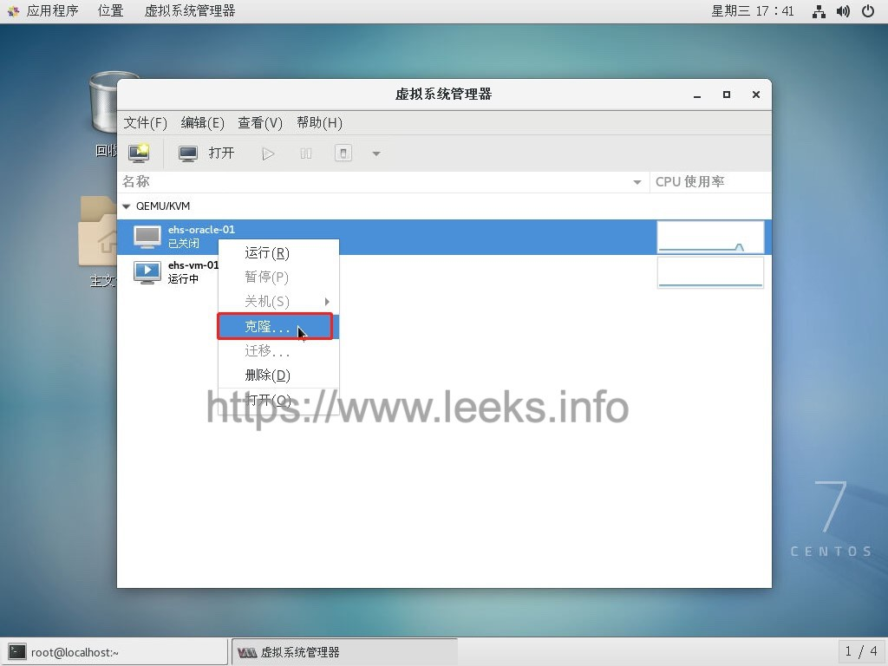
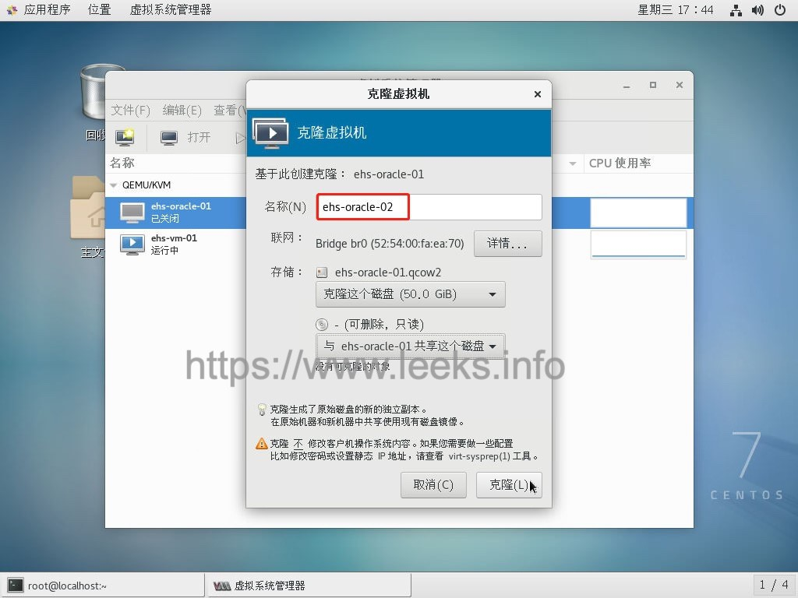

# KVM 克隆系统

> kvm虚拟机的克隆分为两种情况，第一种kvm宿主机上对虚拟机直接克隆；第二种通过复制配置文件与磁盘文件的虚拟机复制克隆(适用于异机的静态迁移)。

## 方法一

kvm宿主机上对虚拟机直接克隆（需要在关机或暂停的状态下操作）

1. 查看所有的虚拟机、以及需要克隆的虚拟机的硬盘文件的位置。

   ```shell
   [root@localhost ~]# virsh list --all
    Id  名称             状态
   ----------------------------------------------------
    9   ehs-jboss-01          running
    -   ehs-oracle-01         关闭
    -   ehs-oracle-02         关闭
   ```

2. 我们可以通过编辑需要克隆的源虚拟机配置文件，去发现它的磁盘文件位置，命令如下： 

   ```shell
   [root@localhost ~]# virsh edit ehs-jboss-01
   ---如通过如下的内容，可以看出磁盘文件的位置
   <source file='/var/lib/libvirt/images/ehs-jboss-01.qcow2'/>
   ```

3. 开始克隆

   将 ehs-jboss-01 虚拟机克隆成新的虚拟机 ehs-jboss-02，新的虚拟机的磁盘文件为 /var/lib/libvirt/images/ehs-jboss-02.qcow2

   ```shell
   [root@localhost ~]# virt-clone -o ehs-jboss-01 -n ehs-jboss-02 -f /var/lib/libvirt/images/ehs-jboss-02.qcow2
   正在分配 'ehs-jboss-02.qcow2'                                                                                                   |  20 GB  00:00:04     
   
   成功克隆 'ehs-jboss-02'。
   ```

4. 这时克隆就完了、我们可以通过 virsh list --all  进行查看，如果需要删除克隆的虚拟机，我们只需要执行如下命令即可。  

   该命令只是删除wintest01的配置文件，并不删除虚拟磁盘文件  

   ```shell
   [root@localhost ~]# virsh undefine ehs-jboss-02
   域 ehs-jboss-02 已经被取消定义
   ```

5. 克隆后操作，登录新主机系统

   ```shell
   # 修改主机名
   [root@ehs-jboss-02 ~]# hostnamectl set-hostname ehs-jboss-02
   
   # 修改主机IP
   [root@ehs-jboss-02 ~]# vim /etc/sysconfig/network-scripts/ifcfg-eth0 
   ```

   

## 方法二

复制配置文件与磁盘文件进行克隆（可以不用关闭源虚拟机）

1. 这里我们还是克隆kvm_client00，我们通过如下命令创建新虚拟机的配置文件

   ```shell
   [root@localhost ~]# virsh dumpxml ehs-jboss-01 > /etc/libvirt/qemu/ehs-jboss-02.xml
   ```

2. 复制原虚拟机的磁盘文件，通过方法一、我们知道，磁盘默认位置为/var/lib/libvirt/images，我们执行如下命令进行复制  

   ```shell
   [root@localhost ~]# cd /var/lib/libvirt/images
   [root@localhost ~]# cp ehs-jboss-01.qcow2 ehs-jboss-02.qcow2
   ```

3. 直接编辑修改配置文件ehs-jboss-02.qcow2，修改name,uuid,disk文件位置,mac地址，vnc端口

4. 通过新虚拟机的配置文件，定义新的虚拟机，只需要执行如下一条命令即可。

   ```shell
   [root@localhost images]# virsh define /etc/libvirt/qemu/ehs-jboss-02.xml
   ```

   需要特别说明的是、以上两种方法克隆的虚拟机、我们都需要进入克隆的新虚拟机里

   修改网卡设备文件/etc/udev/rules.d/70-persistent-net.rules，或者直接将其删除，再重启克隆的目的虚拟机


## KVM克隆 快照

```shell
#本机直接克隆
virt-clone -o ehs-jboss-01 -n ehs-jboss-02 -f /var/lib/libvirt/images/ehs-jboss-02.qcow2
#启动后，修改hostname、IP等
virsh start test2

#2 复制文件方法克隆（相当于备份配置+磁盘，可做迁移）
virsh list --all
virsh dumpxml ehs-jboss-01 > /etc/libvirt/qemu/ehs-jboss-02.xml
cp /kvm/img/ehs-jboss-01.qcow2 /kvm/img/ehs-jboss-02.qcow2
vim /etc/libvirt/qemu/ehs-jboss-02.xml #修改name、UUID、磁盘源、VNC端口
virsh define /etc/libvirt/qemu/ehs-jboss-02.xml #重新定义配置文件
virsh start ehs-jboss-02 #启动后，修改hostname、IP等( 删除/etc/udev/rules.d/70-persistent-net.rules )

#3 连接克隆（磁盘qcow2格式作为一个快照使用，节省磁盘空间）
cat /etc/sysconfig/network-scripts/ifcfg-eth0 #删除MAC绑定
rm -f /etc/udev/rules.d/70-persistent-net.rules
halt
cd /kvm/img
qemu-img create -f qcow2 -b test2.qcow2 test12.qcow2 #关键，创建连接磁盘
virsh dumpxml test2 > /etc/libvirt/qemu/test12.xml
vim /etc/libvirt/qemu/test12.xml #修改name、UUID
virsh define /etc/libvirt/qemu/test12.xml

#########################
#快照 （内置）
#qemu-img snapshot -l /kvm/img/test12.qcow2 #查看磁盘快照
virsh snapshot-list test12 #查看快照
virsh snapshot-create test12 #生成快照
virsh snapshot-create-as test12 snap1 #自定义快照名
virsh snapshot-revert test12 snap1 #快照恢复虚拟
virsh snapshot-delete test12 snapname #删除指定快照
virsh snapshot-current test12
```


## 方法三











