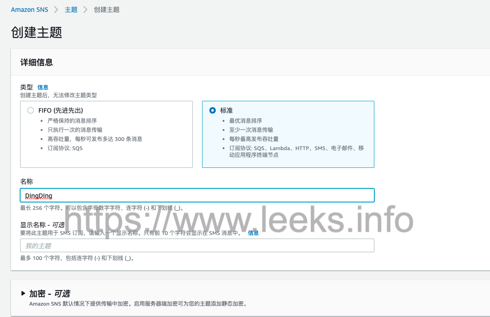
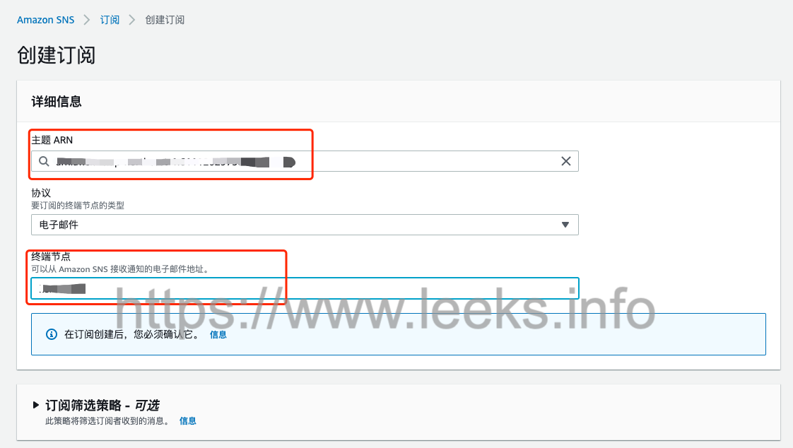
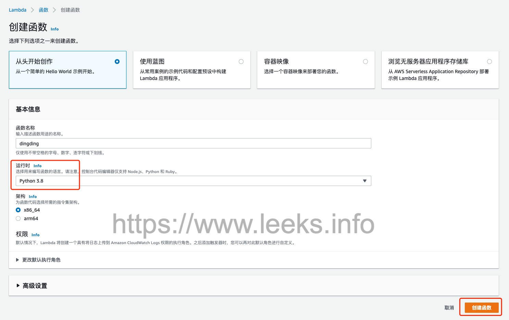

# 钉钉集成 Amazon CloudWatch 消息

## Amazon SNS

1. 创建主题

   

2. 选择标准类型，填写主机显示名称

   

3. 创建订阅

   

4. 确认已订阅

   


## AWS Lambda

1. 创建函数

   

2. 选择从头开始创作，填写函数名称，选择环境变量

   

3. 配置 Lambda 环境变量，access_token 和 auth 填写钉钉机器人 token 信息

   

4. 为Lambda添加触发器：选择上一步创建的SNS作为触发器

   

5. 添加触发器

   


## 打包并上传 Lambda 函数代码

1. 创建文件 `lambda_function.py`，内容如下：

   ```python
   import requests
   import json
   import time
   import urllib
   import base64
   import hashlib
   import hmac
   import os
   
   
   def auth():
       dingding_auth = os.getenv('auth')
       timestamp = round(time.time() * 1000)
       secret_enc = bytes(dingding_auth.encode('utf-8'))
       string_to_sign = '{}\n{}'.format(timestamp, dingding_auth)  # 把 timestamp+"\n"+密钥 当做签名字符串 string_to_sign
       string_to_sign_enc = bytes(string_to_sign.encode('utf-8'))
       hmac_code = hmac.new(secret_enc, string_to_sign_enc,
                            digestmod=hashlib.sha256).digest()  # 使用HmacSHA256算法计算签名，得到 hmac_code
       hmac_code_base64 = base64.b64encode(hmac_code)  # 将hmac_code进行Base64 encode
       sign = urllib.parse.quote(hmac_code_base64)  # 进行urlEncode，得到最终的签名sign
       auth_list = [timestamp, sign]
       return auth_list
   
   
   def send_msg(msg):
       access_token = os.getenv('access_token')
       headers = {'Content-Type': 'application/json'}
       auth_list = auth()
       url = f"https://oapi.dingtalk.com/robot/send?access_token={access_token}&timestamp={str(auth_list[0])}&sign={str(auth_list[1])}"
       print(url)
       r = requests.post(url, data=json.dumps(msg), headers=headers)
       return r.text
   
   
   def lambda_handler(event, context):
       Message = json.loads(event['Records'][0]['Sns']['Message'])
       OldStateValue = Message['OldStateValue']
       NewStateValue = Message['NewStateValue']
       Timestamp = event['Records'][0]['Sns']['Timestamp']
       NewStateReason = json.loads(event['Records'][0]['Sns']['Message'])['NewStateReason']
   
       data = f"#### 警报详细信息 \n ###### 状态改变: {OldStateValue} -> {NewStateValue} \n " \
              f"###### 时间戳: {Timestamp} \n ###### 详细信息: {NewStateReason} \n"
   
       # data = f"#### 警报详细信息 \n ###### 状态改变: ok -> ok \n " \
       #        f"###### 时间戳: 测试告警功能 \n ###### 详细信息: 测试告警功能 \n"
   
       msg = {
           "msgtype": "markdown",
           "markdown": {
               "title": "AWS 云平台告警信息",
               "text": data
           },
           "at": {
               "atMobiles": [
               ],
               "atUserIds": [
               ],
               "isAtAll": "false"
           }
       }
   
       print(msg)
       send_msg(msg)
   ```

2. 打包

   ```shell
   # 创建虚拟环境
   python3 -m venv v-env
   
   # 激活环境
   source v-env/bin/activate
   
   # 使用 pip 安装库
   pip install requests
   
   # 停用虚拟环境使用命令：deactivate
   
   # 使用库内容创建一个 ZIP 存档
   cd v-env/lib/python3.7/site-packages
   
   # 将函数代码添加到存档中
   zip -r9 ${OLDPWD}/function.zip .
   cd $OLDPWD
   zip -g function.zip lambda_function.py
   ```

3. 将二进制 ZIP 部署包上传到Lambda 并更新函数代码

   


## 创建EC2 CloudWatch告警并与SNS关联

1. 选择要监控的 EC2 监控选项卡，创建警报。（下图是中国区控制台界面， AWS Global 控制台界面略有不同）

   

2. 选择前面步骤创建的 SNS 主题，并选择合适的监控告警指标

   

